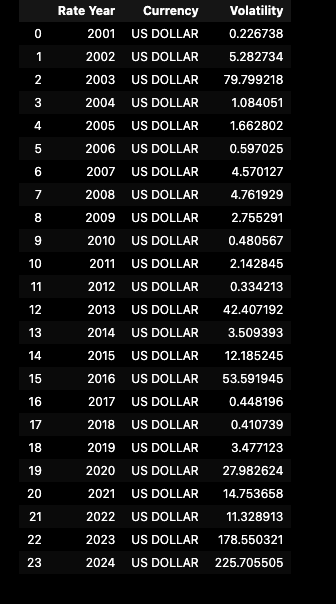
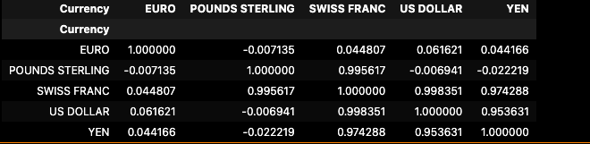
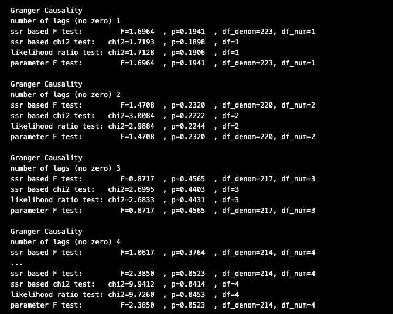
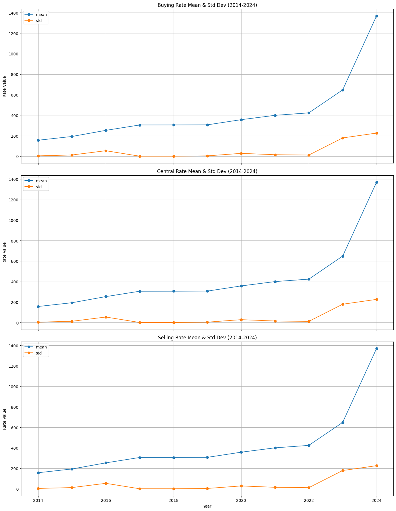
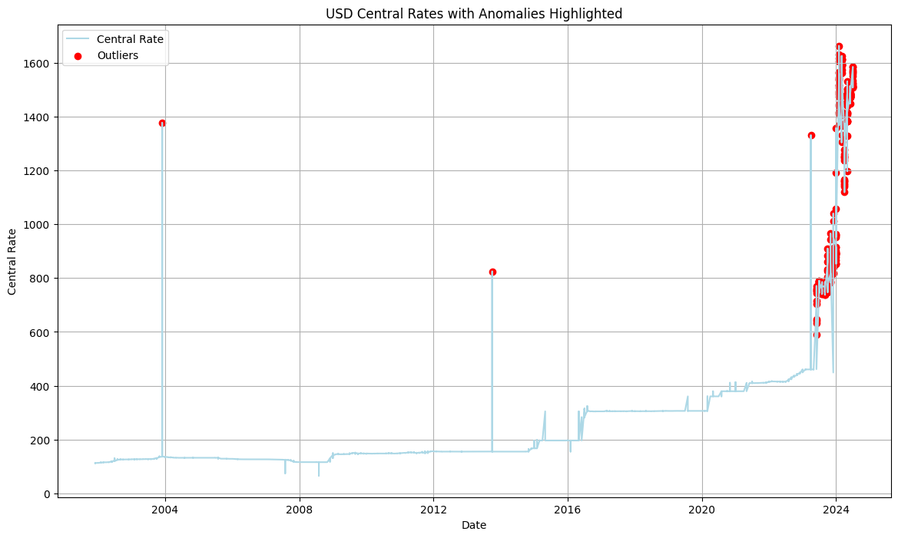

# Exchange Rate-Project
<!-- About The Project -->

<!-- TABLE OF CONTENTS -->

Table of Contents

<ol>
  <li><a href="#description">Description</a></li>
  <li><a href="#dataset">Dataset</a></li>
     <li><a href="#volatility-analysis">Volatility Analysis</a></li>
      <li><a href="#correlation-matrix">Correlation Matrix</a></li>
      <li><a href="#granger-causality-tests">Granger causality tests</a></li>
      <li><a href="#plotting-rate">Plotting Rate</a></li>
      <li><a href="#plotting-anomalies">Plotting Anomalies</a></li>
  <li><a href="#implications">Implications</a></li>
  <li><a href="#conclusion">Conclusion</a></li>
  
  </li>
  </li>
</ol>

# Author: Lilian Ngonadi

# Description

- This project aims to analyze the volatility and identify anomalies in the exchange rate between the US Dollar (USD) and the Nigerian Naira (NGN) over the period from 2001 to 2024. 
- By studying the fluctuations and unusual deviations in the exchange rates, the project seeks to uncover underlying economic factors and provide insights for stakeholders involved in financial planning, investment, and economic policy making

# Dataset

The dataset used in this project, titled "Multi-Currency Exchange Rate Volatility and Anomalies," is a comprehensive collection of historical exchange rate data for the US Dollar (USD) to the Nigerian Naira (NGN) over the period from 2000 to 2024. The dataset includes various attributes that capture the exchange rates and related metrics over this extensive period. Below is a detailed description of the dataset components:

- **Currency** :The currency pair involved in the exchange rate
- **Rate Year** : The year in which the exchange rate was recorded.
- **Rate Month**: The month in which the exchange rate was recorded.
- **Buying Rate** :Represents the cost in NGN to buy one currency.
- **Central Rate** :Used as a benchmark or reference rate for the currency pair
- **Selling Rate** :Represents the amount in NGN received for selling one currency

# Volatility Analysis

The table  below display the volatility of the US Dollar (USD) to Nigerian Naira (NGN) exchange rate from the year 2001 to 2024. The Volatility column measures the standard deviation of the exchange rate for each year, which indicates how much the exchange rate fluctuated during that year.

- Low Volatility Years: Years like 2001, 2002, 2006, 2010, and 2017-2018 showed low volatility, meaning the USD/NGN exchange rate was relatively stable during those years.
- High Volatility Years: Years like 2003, 2013, 2020-2024 show very high volatility. Particularly, 2024 exhibits an exceptionally high volatility value of 225.71 suggesting extreme fluctuations in the exchange rate, which is due to economic instability, policy changes and other significant factors impacting the currency market.

# Correlation Matrix

From the provided correlation matrix:
- EURO and US DOLLAR: Correlation of 0.061621 indicates a very weak positive linear relationship.
- POUNDS STERLING and SWISS FRANC: Correlation of 0.995617 indicates a very strong positive linear relationship.
- SWISS FRANC and US DOLLAR: Correlation of 0.998351 indicates a very strong positive linear relationship.
- US DOLLAR and YEN: Correlation of 0.953631 indicates a strong positive linear relationship.

# Granger causality tests
## Strong Correlations Without Causality:

- High correlations (e.g., between POUNDS STERLING and SWISS FRANC) indicate that these currencies tend to move together linearly. However, the lack of Granger causality suggests that while they move together, past values of one do not help predict the future values of the other. This could be due to external factors affecting both currencies similarly rather than a direct predictive relationship.
## Weak Correlations and No Causality:
- Weak correlations (between EURO and US DOLLAR) and no Granger causality indicate no significant linear relationship or predictive power between these currencies. Their movements are largely independent of each other.
Even if currencies are correlated, it doesn't mean one can predict the other, which aligns with your Granger causality test results.

# Plotting Rate

- Rising Means: All three rates (buying, central, and selling) show a consistent upward trend in their means, particularly after 2022. This suggests a significant increase in exchange rates across the board.
- Increasing Volatility: The standard deviations for all three rates remain relatively low and stable until about 2022, after which there is a marked increase. This implies that the exchange rates have become more volatile in the recent years, particularly from 2022 to 2024.

# Plotting Anomalies

- Central Rate Trend:
  From around 2000 to 2015, the central rate remained relatively stable with minor fluctuations.
  Starting from around 2014, there is a noticeable increase in the central rate, which accelerates sharply after 2022.
- Anomalies:
  Significant anomalies are highlighted in 2004, 2014, and from 2022 onwards.
  The anomalies in 2004 and 2014 stand out as isolated spikes, indicating sudden and brief deviations from the general trend during those years.
  From 2022 onwards, there is a cluster of anomalies, suggesting persistent and frequent deviations from the expected central rate.

  

# Implications
- Economic Analysis: The sharp rise in the central rate and the increase in anomalies from 2020 onwards might reflect underlying economic turbulence. Anomalies could be due to specific events like economic crises, changes in trade policies, geopolitical events, or market speculation.
- Risk Management: For investors and businesses, the increase in anomalies signifies higher risk. Strategies to hedge against exchange rate volatility would be crucial during this period.
- Policy Making: Policymakers might need to investigate the causes of these anomalies and sharp increases in the exchange rate to implement measures that stabilize the economy and currency.

# Conclusion
The chart highlights a significant shift in the USD central exchange rate trend starting from around 2022, with a notable increase in volatility and anomalies. This suggests a period of economic uncertainty and potential instability, requiring careful analysis and strategic planning for those affected by these exchange rate fluctuations.

